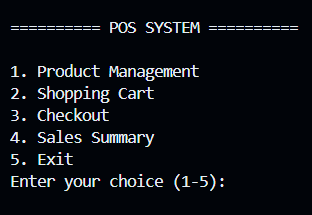

# POS-System
A console-based Point of Sale (POS) system built with Java.

## Key Features

- Product management (Add, View, Search, Update, Delete)
- Shopping cart management
- Checkout with order confirmation
- Automatic order ID generation
- Automatic inventory update after checkout
- Sales summary and revenue statistics
- Persistent data storage using File I/O
- Input validation for user input

## Technologies

- File I/O
- ArrayList

## Project Structure

- **MainConsole.java** – Handles menu navigation
- **POSSystem.java** – Manages checkout and sales summary
- **Product.java** – Represents product information
- **ProductManager.java** – Handles product management
- **CartItem.java** – Represents an item in the shopping cart
- **ShoppingCart.java** – Manages shopping cart operations
- **Order.java** – Represents a customer order
- **FileManager.java** – Reads and writes product and order data

## Requirements

- Java JDK 17 or above
- Any Java IDE (VS Code, IntelliJ IDEA)

## How to Run

1. Clone the repository.
2. Open the project in a Java IDE.
3. Run 'MainConsole.java'.

## Learning Objective

- Practice File IO.
- Building Foundamental for JDBC.
- Understand the process of developing a project.
